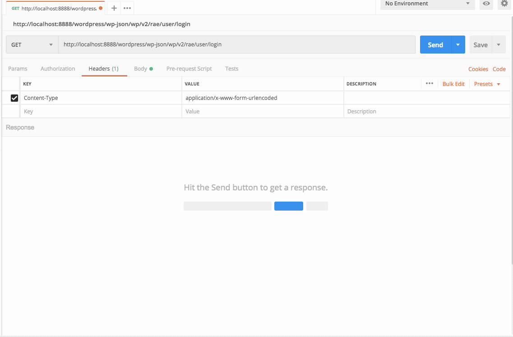
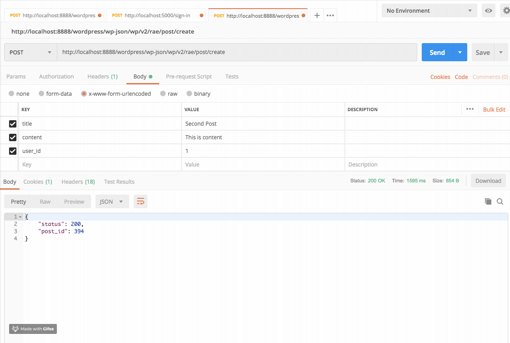

# Headless CMS

A WordPress plugin that adds features to use WordPress as a headless CMS with any front-end environment using REST API

## Maintainers

| Name                                                   | Github Username |
|--------------------------------------------------------|-----------------|
| [Imran Sayed](mailto:codeytek.academy@gmail.com)       |  @imranhsayed   |

## Assets

Assets folder contains webpack setup and can be used for creating blocks or adding any other custom scripts like javascript for admin.

- Run `npm i` from `assets` folder to install required npm packages.
- Use `npm run dev` during development for assets.
- Use `npm run prod` for production.
- Use `npm run eslint:fix js/fileName.js` for fixing and linting eslint errors and warning.

# REST API ENDPOINT

> This plugin provides you different endpoints using WordPress REST API.

* :bust_in_silhouette: Login End Point
* :page_with_curl: Create Post End Point

## Login Endpoint Demo :video_camera:

When we access the end point on URI: `http://your-domain/wp-json/wp/v2/rae/user/login`,
and we pass our username and password in the body using postman, we get the following with a status code:
* User Object on success
* Error when fields are empty or incorrect credentials
* Any other error.

## Create a new post Endpoint Demo :video_camera:

When we access the end point on URI: `http://your-domain/wp-json/wp/v2/rae/post/create`,
and we pass our 'user_id', 'title' and 'content' in the body using postman, we get the following with a status code:
* New post id if the post is created.
* Error when fields are empty or if the user with the given id does not have capability to publish posts.
* Any other error.

## Getting Started :clipboard:

These instructions will get you a copy of the project up and running on your local machine for development purposes.

## Prerequisites :door:

You need to have any WordPress theme activated on your WordPress project, which has REST API enabled.

## Installation :wrench:

1. Clone the plugin directory in the `/wp-content/plugins/` directory, or install a zipped directory of this plugin through the WordPress plugins screen directly.
2. Activate the plugin through the 'Plugins' screen in WordPress

## Use :ski:

There are different end points that are available. Some are public while others are protected.

* :bust_in_silhouette: Login End Point `http://your-domain/wp-json/wp/v2/rae/user/login`

> Params to be sent in the body
`username(String)` and `password(String)`
Return Value: `User Object or Error (Object)`

* :page_with_curl: Create Post End Point `http://your-domain/wp-json/wp/v2/rae/post/create`

> Params to be sent in the body
`user_id(Int)`, `title(String)` and `content(String)`
Return Value: `Object with post ID and status or Error (Object)`

## Features
* Adds option to add social links in customizer
* Registers two custom menus for header ( menu location = rwt-menu-header ) and for footer ( menu location = rwt-menu-footer )
* Registers the following sidebars
1. RWT Footer #1 with sidebar id 'rwt-sidebar-1'
2. RWT Footer #2 with sidebar id 'rwt-sidebar-2'

* Registers custom end points

## Available Endpoints:

### Get single post ( GET request )
* `http://example.com/wp-json/rae/v1/post?post_id=1`

### Get posts by page no: ( GET Request )
* `http://example.com/wp-json/rae/v1/posts?page_no=1`

### Get header and footer date: ( GET Request )
* Get the header data ( site title, site description , site logo URL, menu items ) and footer data ( footer menu items, social icons )
* `http://example.com/wp-json/rae/v1/header-footer?header_location_id=primary&footer_location_id=secondary`

### Create new post: ( POST Request )
* http://example.com/wp-json/rae/v1/post/create

## Contributing :busts_in_silhouette:

Please read [CONTRIBUTING.md](https://gist.github.com/PurpleBooth/b24679402957c63ec426) for details on our code of conduct, and the process for submitting pull requests to us.

## Versioning

I use [Git](https://github.com/) for versioning. 

## Author :pencil:

* **[Imran Sayed](https://codeytek.com)**

## License :page_facing_up:

- **[MIT license](http://opensource.org/licenses/mit-license.php)**
