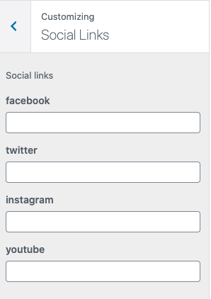
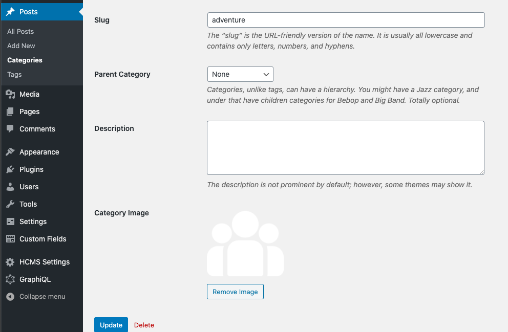
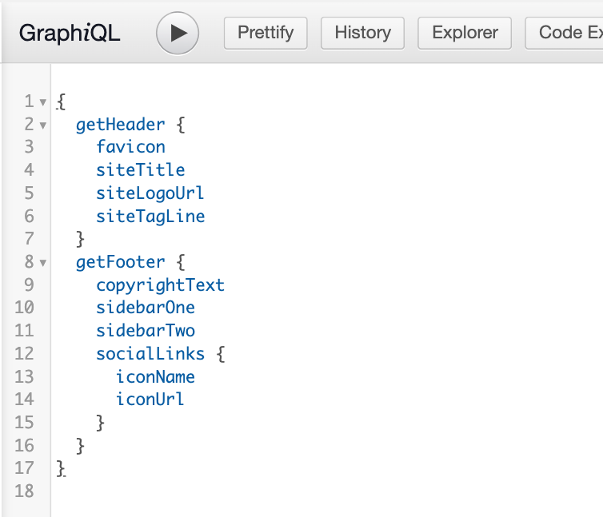

# Headless CMS

[](https://www.repostatus.org/#active)


A WordPress plugin that adds features to use WordPress as a headless CMS with any front-end environment using REST API.
This plugin provides multiple features and you can use the one's that are relevant to your front-end application.
You don't necessarily need to use all.


<a href="https://youtu.be/nYXL1KKjKrc" target="_blank">

</a>

## Install via Composer

```shell script
composer require imranhsayed/headless-cms
```

## Install from WordPress.org

Download and activate plugin from [WordPress.org](https://wordpress.org/plugins/headless-cms/)

## Maintainer

| Name                                                   | Github Username |
|--------------------------------------------------------|-----------------|
| [Imran Sayed](mailto:codeytek.academy@gmail.com)       |  @imranhsayed   |

## Assets

Assets folder contains webpack setup and can be used for creating blocks or adding any other custom scripts like javascript for admin.

- Run `npm i` from `assets` folder to install required npm packages.
- Use `npm run dev` during development for assets.
- Use `npm run prod` for production.
- Use `npm run eslint:fix js/fileName.js` for fixing and linting eslint errors and warning.

# REST API ENDPOINT

> This plugin provides you different endpoints using WordPress REST API.

## Getting Started :clipboard:

These instructions will get you a copy of the project up and running on your local machine for development purposes.

## Prerequisites :door:

You need to have any WordPress theme activated on your WordPress project, which has REST API enabled.

## Installation :wrench:

1. Clone the plugin directory in the `/wp-content/plugins/` directory, or install a zipped directory of this plugin through the [WordPress plugins](https://wordpress.org/plugins/headless-cms/) screen directly.
2. Activate the plugin through the 'Plugins' screen in WordPress

## Example Frontend applications

Example of front-end applications where this plugin can be used:

1. [Gatsby WordPress Theme](https://github.com/imranhsayed/gatsby-wordpress-themes)
2. [React Wordpress Theme](https://github.com/imranhsayed/react-wordpress-theme)

## Features

1. Custom REST API Endpoints.
2. Social links in customizer.
3. Image uploads for categories.
4. Custom header and footer menus.
5. Custom Widgets.
6. Custom Header and Footer GraphQL fields when using [wp-graphql](https://github.com/wp-graphql/wp-graphql) plugin
7. Adds coAuthors data in the GraphQL Api.

* Adds option to add social links in customizer
* Registers two custom menus for header ( menu location = hcms-menu-header ) and for footer ( menu location = hcms-menu-footer )
* Registers the following sidebars

1. HCMS Footer #1 with sidebar id 'hcms-sidebar-1'


2. HCMS Footer #2 with sidebar id 'hcms-sidebar-2'


### More Features
1. Registers the sections for socials icons in the customizer

* Social icons urls for 'facebook', 'twitter', 'instagram', 'youtube'



2. Image upload features for categories

* Provides Image upload features for categories.



3. Plugin Settings Page

* Settings for getting data for a custom page like Hero section, Search section, Featured post section, latest posts heading.

* Registers custom end points

4. Custom Header and Footer GraphQL fields when using [wp-graphql](https://github.com/wp-graphql/wp-graphql) plugin.


## Available Endpoints:

### Get single post ( GET request )
* `http://example.com/wp-json/rae/v1/post?post_id=1`

### Get posts by page no: ( GET Request )
* `http://example.com/wp-json/rae/v1/posts?page_no=1`

### Get header and footer date: ( GET Request )
* Get the header data ( site title, site description , site logo URL, menu items ) and footer data ( footer menu items, social icons )
* `http://example.com/wp-json/rae/v1/header-footer?header_location_id=hcms-menu-header&footer_location_id=hcms-menu-footer`

## Contributing :busts_in_silhouette:

Please read [CONTRIBUTING.md](https://gist.github.com/PurpleBooth/b24679402957c63ec426) for details on our code of conduct, and the process for submitting pull requests to us.

## Versioning

I use [Git](https://github.com/) for versioning. 

## Author :pencil:

* **[Imran Sayed](https://codeytek.com)**

## License :scroll:


- **[GPLv2](https://www.gnu.org/licenses/old-licenses/gpl-2.0.en.html)**
